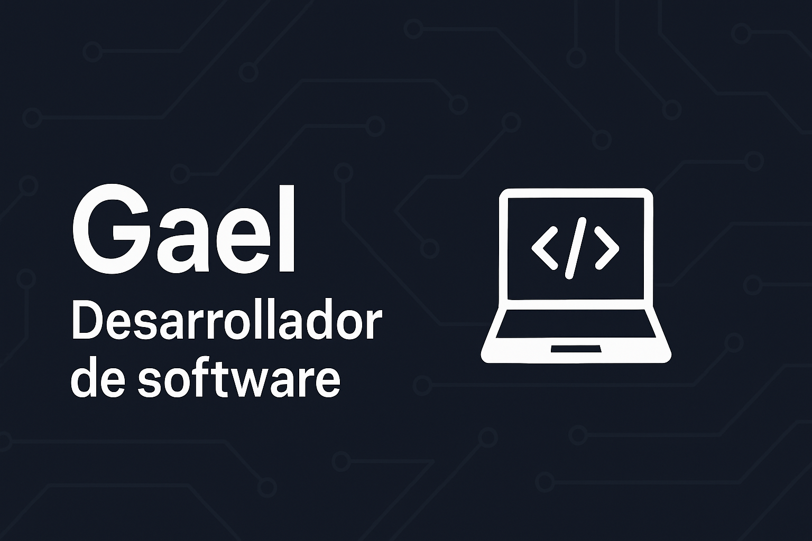

<h1 align="center">¡Hola! 👋 Soy Gael</h1>

  

🎓 Estudiante de Tecnologías de la Información  
🔧 Apasionado por el desarrollo de software, electrónica y visión por computadora  
📍 Desde Nogales, Sonora

---

## 🚀 Tecnologías que uso

**Lenguajes:**  
  
  
  
  

**Frameworks y herramientas:**  
  
  
  
  

**Hardware:**  
ESP32, Arduino, sensores ultrasónicos, servos, comunicación serial.

---

## 🛠️ Experiencia con hardware

- ⚡ Programación de microcontroladores (ESP32, Arduino)  
- 📶 Comunicación serial, sensores, control de servos  
- 👁️ Integración con visión artificial en tiempo real

---

## 📌 Proyectos destacados

### 🔍 **Sistema de detección de placas en tiempo real**
- 🚘 YOLOv8 + OpenCV + Tesseract OCR  
- 📡 Velocidad capturada desde Arduino  
- 🖥 GUI con conexión a Firebase  
- 📷 Cámara: Microsoft LifeCam Studio

### 🗓 **Gestión de días de descanso UTN**
- 🧾 PHP + MySQL  
- 🧑‍💼 Manejo de vacaciones, incapacidades, días sindicales  
- 🛡 Validación por cláusulas sindicales

### 📲 **Aplicaciones móviles con Flutter**
- 📱 UI moderna y responsiva  
- 🔄 Consumo de APIs REST, Firebase  
- 📦 Apps multiplataforma (Android / iOS)

---

## 📫 ¿Quieres contactarme?

  

---

