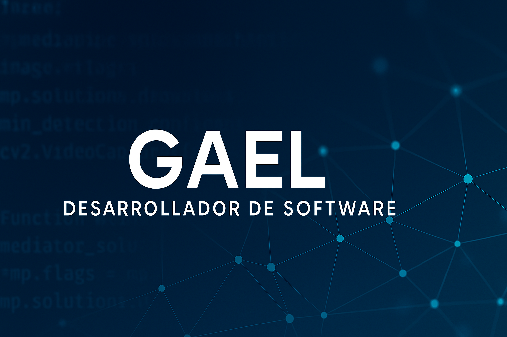

<h1 align="center">¡Hola!, soy Gael 👋</h1>

  

  🎓 Estudiante de Tecnologías de la Información en Multiplataforma  
  💻 Desarrollador con enfoque en **software, electrónica y visión por computadora**  
  🌎 Desde Nogales, Sonora | 📅 Disponible para prácticas profesionales

---

## 🚀 Tecnologías principales

### 💻 Lenguajes de programación

  
  
  
  
  

### ⚙️ Frameworks y herramientas

  
  
  
  
  

### 🔌 Hardware y electrónica

  <strong>ESP32 · Arduino · Sensores ultrasónicos · Servos · Comunicación serial</strong>

---

## 🛠️ Experiencia destacada

- 🔧 Desarrollo de soluciones con integración hardware-software
- 🔍 Implementación de modelos de visión por computadora en tiempo real
- 🧠 Automatización con inteligencia artificial y control por sensores
- 🗃️ Gestión de datos con bases MySQL y Firestore

---

## 📌 Proyectos destacados

### 🚘 Sistema de detección de placas en tiempo real
> YOLOv8 · OpenCV · Tesseract OCR · Firebase · Arduino

- Detección automática de placas con reconocimiento de texto
- Obtención de velocidad desde sensores ultrasónicos vía Arduino
- GUI con visualización en tiempo real y generación de reportes

### 🗓 Sistema de gestión de días UTN
> PHP · MySQL · Bootstrap

- Control de vacaciones, días sindicales y permisos especiales
- Validación según cláusulas del contrato colectivo de la UTN
- Roles de usuario y autenticación personalizada

### 📱 Apps móviles multiplataforma
> Flutter · Dart · Firebase · REST API

- Interfaces modernas, responsivas y conectadas a la nube
- Funcionalidad online/offline y notificaciones push
- Desarrollo para Android e iOS desde un solo código

## 📫 Contáctame

  
  

---

## ✨ Sobre mí

- 🧠 Me apasiona aplicar la tecnología para resolver problemas reales  
- 📈 Siempre estoy aprendiendo nuevas herramientas y frameworks  
- 🤝 Busco oportunidades para colaborar en proyectos innovadores
  
---

- > ⚠️ *Este portafolio está en construcción. Pronto iré subiendo proyectos y mas contenido.*

---

